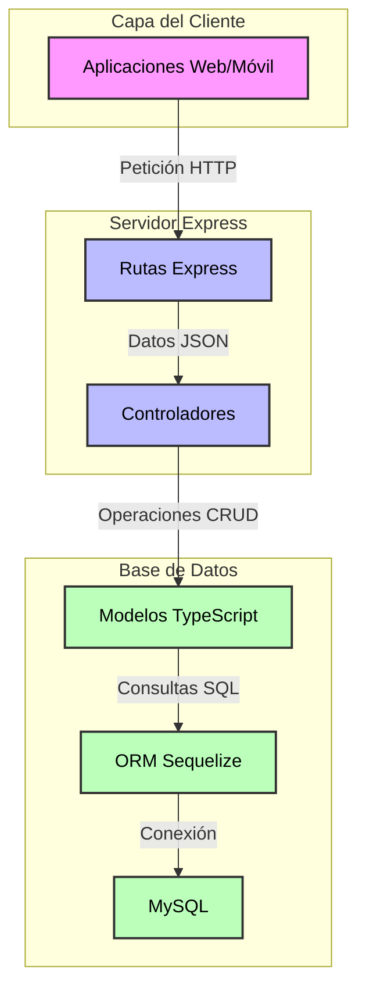

Para crear una API REST con Express, TypeScript y Sequelize conectada a MySQL, seguiremos un proceso estructurado que te permitirá tener una aplicación funcional rápidamente.

### Conceptos Fundamentales

1. **Express**: Framework para Node.js que facilita la creación de APIs REST
2. **TypeScript**: Extensión de JavaScript que añade tipos estáticos para mayor seguridad
3. **Sequelize**: ORM (Object Relational Mapping) que simplifica las interacciones con MySQL
4. **MySQL**: Base de datos relacional para almacenar nuestros datos




Como muestra el diagrama, el flujo de datos es el siguiente:

1. Las peticiones HTTP llegan desde el cliente a las rutas de Express
2. Las rutas dirigen las peticiones a los controladores apropiados
3. Los controladores procesan la lógica de negocio y comunican con los modelos
4. Los modelos definidos en TypeScript utilizan Sequelize para transformar operaciones JavaScript en consultas SQL
5. Finalmente, Sequelize se comunica directamente con MySQL para ejecutar las consultas

### Implementación Paso a Paso

 Crear el proyecto y configurar TypeScript
```bash
mkdir api-express-ts-mysql
cd api-express-ts-mysql
npm init -y
npm install express sequelize mysql2 sequelize-typescript reflect-metadata typescript ts-node-dev @types/node @types/express --save
```

 Configurar TypeScript (tsconfig.json)

```json
{
  "compilerOptions": {
    "target": "ES2020",
    "module": "commonjs",
    "outDir": "./dist",
    "rootDir": "./src",
    "strict": true,
    "esModuleInterop": true,
    "skipLibCheck": true,
    "forceConsistentCasingInFileNames": true,
    "experimentalDecorators": true,
    "emitDecoratorMetadata": true
  },
  "include": ["src/**/*"],
  "exclude": ["node_modules"]
}
```

 Configurar la conexión a MySQL (src/config/database.ts)
```typescript
import { Sequelize } from 'sequelize-typescript';

export const sequelize = new Sequelize({
  dialect: 'mysql',
  host: 'localhost',
  username: 'tu_usuario',
  password: 'tu_contraseña',
  database: 'nombre_base_datos',
  models: [__dirname + '/../models'],
  logging: false
});
```

Crear el servidor principal (src/server.ts)
 
```ts
import express, { Request, Response } from 'express';
import { sequelize } from './config/database';

const app = express();

app.use(express.json());

// Middleware de manejo de errores
app.use((err: Error, req: Request, res: Response, next: Function) => {
  console.error(err.stack);
  res.status(500).send('Error interno del servidor');
});

// Inicializar la aplicación
async function start() {
  try {
    await sequelize.sync({ force: false });
    
    const PORT = process.env.PORT || 3000;
    app.listen(PORT, () => {
      console.log(`Servidor iniciado en el puerto ${PORT}`);
    });
  } catch (error) {
    console.error('Error al iniciar la aplicación:', error);
    process.exit(1);
  }
}

start();
```

 Ejemplo de modelo (src/models/User.ts)
```typescript
import { Table, Model, Column, DataType } from 'sequelize-typescript';

@Table({
  tableName: 'users'
})
export class User extends Model<User> {
  @Column({
    type: DataType.STRING,
    allowNull: false
  })
  nombre!: string;

  @Column({
    type: DataType.STRING,
    allowNull: false,
    unique: true
  })
  email!: string;

  @Column({
    type: DataType.STRING,
    allowNull: false
  })
  password!: string;
}
```

 Ejemplo de ruta (src/routes/users.ts)
```typescript
import { Router } from 'express';
import { User } from '../models/User';

const router = Router();

router.get('/', async (_, res) => {
  try {
    const users = await User.findAll();
    res.json(users);
  } catch (error) {
    res.status(500).json({ message: 'Error al obtener usuarios' });
  }
});

router.post('/', async (req, res) => {
  try {
    const user = await User.create(req.body);
    res.status(201).json(user);
  } catch (error) {
    res.status(500).json({ message: 'Error al crear usuario' });
  }
});

export default router;
```

### Comandos Útiles

```bash
# Iniciar el desarrollo
npm run dev

# Compilar TypeScript
npm run build

# Iniciar la versión compilada
npm start
```

### Notas Importantes

1. Asegúrate de tener MySQL instalado y configurado en tu máquina
2. Reemplaza los valores de conexión (usuario, contraseña, base de datos) con tus credenciales reales
3. Para producción, considera agregar:
     - Autenticación y autorización
  - Validación de entrada de datos
  - Manejo de errores robusto
  - Documentación de APIs
  - Variables de entorno para configuración