Para crear una API REST con Express, TypeScript y Sequelize conectada a MySQL, seguiremos un proceso estructurado que te permitirá tener una aplicación funcional rápidamente.

### Conceptos Fundamentales

1. **Express**: Framework para Node.js que facilita la creación de APIs REST
2. **TypeScript**: Extensión de JavaScript que añade tipos estáticos para mayor seguridad
3. **Sequelize**: ORM (Object Relational Mapping) que simplifica las interacciones con MySQL
4. **MySQL**: Base de datos relacional para almacenar nuestros datos

```mermaid
flowchart TD
    subgraph Cliente["Capa del Cliente"]
        Client["Aplicaciones Web/Móvil"]
    end
    subgraph Servidor["Servidor Express"]
        Routes["Rutas Express"]
        Controllers["Controladores"]
    end

    subgraph BD["Base de Datos"]
        Models["Modelos TypeScript"]
        Sequelize["ORM Sequelize"]
        MySQL["MySQL"]
    end

    Client -->|"Petición HTTP"| Routes
    Routes -->|"Datos JSON"| Controllers
    Controllers -->|"Operaciones CRUD"| Models
    Models -->|"Consultas SQL"| Sequelize
    Sequelize -->|"Conexión"| MySQL

    classDef client fill:#f9f,stroke:#333,stroke-width:2px,color:#000
    classDef server fill:#bbf,stroke:#333,stroke-width:2px,color:#000
    classDef db fill:#bfb,stroke:#333,stroke-width:2px,color:#000

    class Client client
    class Routes,Controllers server
    class Models,Sequelize,MySQL db
```



Como muestra el diagrama, el flujo de datos es el siguiente:

1. Las peticiones HTTP llegan desde el cliente a las rutas de Express
2. Las rutas dirigen las peticiones a los controladores apropiados
3. Los controladores procesan la lógica de negocio y comunican con los modelos
4. Los modelos definidos en TypeScript utilizan Sequelize para transformar operaciones JavaScript en consultas SQL
5. Finalmente, Sequelize se comunica directamente con MySQL para ejecutar las consultas

## Instalación Dependencias

Crear el proyecto y configurar TypeScript

```bash
mkdir api-express-ts-mysql
cd api-express-ts-mysql
npm init -y
npm install express sequelize @sequelize/core dotenv mysql2 sequelize-typescript reflect-metadata
# Instalar dependencias de desarrollo
npm install -D typescript ts-node-dev @types/node @types/express sequelize-cli 
```

#### 📦 Comando completo:

---

#### 🔧 Dependencias explicadas:

##### 1. **`express`**

* **¿Qué es?** Framework de Node.js para construir APIs y aplicaciones web.
* **¿Para qué se usa?** Manejar rutas, middleware, peticiones y respuestas HTTP de forma sencilla.

---

##### 2. **`sequelize`**

* **¿Qué es?** ORM (Object-Relational Mapper) para Node.js.
* **¿Para qué se usa?** Permite trabajar con bases de datos relacionales (como MySQL) usando objetos en JavaScript/TypeScript en lugar de escribir SQL manual.

---

##### 3. **`mysql2`**

* **¿Qué es?** Cliente de MySQL para Node.js, compatible con `sequelize`.
* **¿Para qué se usa?** Permite que Sequelize se conecte a una base de datos MySQL o MariaDB.

---

##### 4. **`sequelize-typescript`**

* **¿Qué es?** Extensión de `sequelize` que permite usar decoradores TypeScript (`@Table`, `@Column`, etc.).
* **¿Para qué se usa?** Facilita la integración de Sequelize con TypeScript al permitir una sintaxis más limpia y orientada a clases.

---

##### 5. **`reflect-metadata`**

* **¿Qué es?** Librería que permite usar metadatos con decoradores en TypeScript.
* **¿Para qué se usa?** Necesaria para que los decoradores funcionen correctamente (como los de `sequelize-typescript`).

---

##### 6. **`typescript`**

* **¿Qué es?** El compilador TypeScript.
* **¿Para qué se usa?** Transpila TypeScript (`.ts`) a JavaScript (`.js`) para que Node.js lo entienda.

---

##### 7. **`ts-node-dev`**

* **¿Qué es?** Ejecuta archivos `.ts` directamente y reinicia el servidor automáticamente cuando detecta cambios.
* **¿Para qué se usa?** Muy útil en desarrollo, similar a `nodemon` pero compatible con TypeScript.

---

##### 8. **`@types/node`**

* **¿Qué es?** Tipado de Node.js.
* **¿Para qué se usa?** Permite usar funcionalidades de Node con autocompletado y verificación de tipos en TypeScript (como `fs`, `path`, etc.).

---

##### 9. **`@types/express`**

* **¿Qué es?** Tipado para Express.
* **¿Para qué se usa?** Proporciona los tipos de Express para que tu código TypeScript sepa cómo trabajar con `Request`, `Response`, etc.

---

##### 🏷️ Sobre las banderas usadas

##### 🔹 `--save`

* **¿Qué hace?** Guarda las dependencias en el archivo `package.json` bajo `"dependencies"`.
* ⚠️ *Nota:* Desde npm v5 (2017), **ya no es necesario** usar `--save`, porque se guarda automáticamente.

---

### ✅ Resultado final en tu `package.json`

Estas dependencias estarán en la sección:

```json
"dependencies": {
  "express": "...",
  "sequelize": "...",
  "mysql2": "...",
  "sequelize-typescript": "...",
  "reflect-metadata": "..."
},
"devDependencies": {
  "typescript": "...",
  "ts-node-dev": "...",
  "@types/node": "...",
  "@types/express": "..."
}
```

*Idealmente deberías mover las dependencias de desarrollo (como TypeScript y los `@types`) a `"devDependencies"` para mayor claridad.*

---
Configurar TypeScript (tsconfig.json)

- se puede usar el comando `npx tsc --init` para generar un archivo `tsconfig.json` básico.
  - se puede personalizar como el ejemplo del siguiente punto.
- Se puede crear un archivo `tsconfig.json` en la raíz del proyecto con el siguiente contenido:

```json
{
  "compilerOptions": {
    "target": "ES2020",
    "module": "commonjs",
    "outDir": "./dist",
    "rootDir": "./src",
    "strict": true,
    "esModuleInterop": true,
    "skipLibCheck": true,
    "forceConsistentCasingInFileNames": true,
    "experimentalDecorators": true,
    "emitDecoratorMetadata": true
  },
  "include": ["src/**/*"],
  "exclude": ["node_modules"]
}
```

Configurar la conexión a MySQL (src/config/database.ts)

```typescript
import { Sequelize } from "sequelize-typescript";

export const sequelize = new Sequelize({
  dialect: "mysql",
  host: "localhost",
  username: "tu_usuario",
  password: "tu_contraseña",
  database: "nombre_base_datos",
  models: [__dirname + "/../models"],
  logging: false,
});
```

Crear el servidor principal (src/server.ts)

```ts
import express, { Request, Response } from "express";
import { sequelize } from "./config/database";

const app = express();

app.use(express.json());

// Middleware de manejo de errores
app.use((err: Error, req: Request, res: Response, next: Function) => {
  console.error(err.stack);
  res.status(500).send("Error interno del servidor");
});

// Inicializar la aplicación
async function start() {
  try {
    await sequelize.sync({ force: false });

    const PORT = process.env.PORT || 3000;
    app.listen(PORT, () => {
      console.log(`Servidor iniciado en el puerto ${PORT}`);
    });
  } catch (error) {
    console.error("Error al iniciar la aplicación:", error);
    process.exit(1);
  }
}

start();
```

Ejemplo de modelo (src/models/User.ts)

```typescript
import { Table, Model, Column, DataType } from "sequelize-typescript";

@Table({
  tableName: "users",
})
export class User extends Model<User> {
  @Column({
    type: DataType.STRING,
    allowNull: false,
  })
  nombre!: string;

  @Column({
    type: DataType.STRING,
    allowNull: false,
    unique: true,
  })
  email!: string;

  @Column({
    type: DataType.STRING,
    allowNull: false,
  })
  password!: string;
}
```

Ejemplo de ruta (src/routes/users.ts)

```typescript
import { Router } from "express";
import { User } from "../models/User";

const router = Router();

router.get("/", async (_, res) => {
  try {
    const users = await User.findAll();
    res.json(users);
  } catch (error) {
    res.status(500).json({ message: "Error al obtener usuarios" });
  }
});

router.post("/", async (req, res) => {
  try {
    const user = await User.create(req.body);
    res.status(201).json(user);
  } catch (error) {
    res.status(500).json({ message: "Error al crear usuario" });
  }
});

export default router;
```

### Comandos Útiles

```bash
# Iniciar el desarrollo
npm run dev

# Compilar TypeScript
npm run build

# Iniciar la versión compilada
npm start
```

### Notas Importantes

1. Asegúrate de tener MySQL instalado y configurado en tu máquina
2. Reemplaza los valores de conexión (usuario, contraseña, base de datos) con tus credenciales reales
3. Para producción, considera agregar:
   - Autenticación y autorización

- Validación de entrada de datos
- Manejo de errores robusto
- Documentación de APIs
- Variables de entorno para configuración
