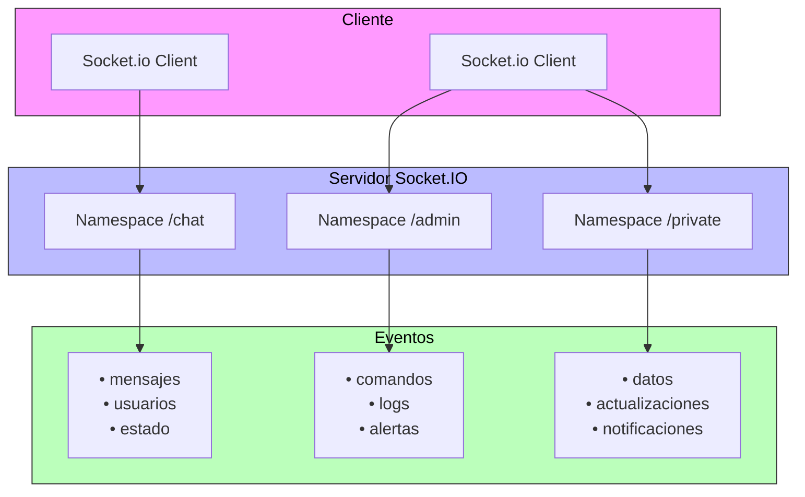

Los namespaces en Socket.IO son canales de comunicación independientes que permiten dividir la lógica de tu aplicación sobre una única conexión compartida 7:1. Cada namespace funciona como un espacio aislado donde puedes enviar y recibir mensajes sin interferir con otros namespaces.

Veamos cómo funciona la arquitectura de namespaces:



En el diagrama podemos observar:

- Los clientes pueden conectarse a múltiples namespaces simultáneamente
- Cada namespace maneja sus propios eventos de forma independiente
- La comunicación es aislada entre namespaces, lo que permite una mejor organización de la aplicación

### Casos de Uso Comunes

1. **Aplicaciones Multi-tenant**:
          - Cada cliente tiene su propio namespace
  - Datos completamente aislados entre clientes
  - Ejemplo: `io.of('/tenant-1')` y `io.of('/tenant-2')`


2. **Áreas Seguras**:
          - Namespace para administradores
  - Validación de permisos antes de la conexión
  - Ejemplo: `io.of('/admin')` con middleware de autenticación


3. **Aplicaciones Modulares**:
          - Chat general y chat privado
  - Notificaciones y mensajes en tiempo real
  - Ejemplo: `io.of('/chat')` y `io.of('/notifications')`


### Implementación en el Backend

```typescript {6}
// chat.gateway.ts
import { WebSocketGateway, Namespace } from '@nestjs/websockets';
import { Server } from 'socket.io';

@WebSocketGateway({
  namespace: 'chat',
  cors: {
    origin: '*',
    methods: ['GET', 'POST']
  }
})
export class ChatGateway {
  @WebSocketServer() server: Server;

  afterInit(server: Server) {
    console.log('Namespace chat inicializado');
  }

  handleConnection(client: any) {
    console.log('Cliente conectado al chat:', client.id);
  }

  handleDisconnect(client: any) {
    console.log('Cliente desconectado del chat:', client.id);
  }

  @SubscribeMessage('message')
  handleMessage(@MessageBody() message: string) {
    this.server.emit('message', message);
  }
}
```

### Implementación en el Frontend

```javascript
// Conexión a múltiples namespaces
const socketChat = io('/chat');
const socketAdmin = io('/admin', {
  auth: {
    token: 'tu-token-admin'
  }
});

// Manejar eventos en cada namespace
socketChat.on('message', (msg) => {
  console.log('Mensaje del chat:', msg);
});

socketAdmin.on('command', (cmd) => {
  console.log('Comando admin:', cmd);
});

// Manejar errores de conexión
socketAdmin.on('connect_error', (error) => {
  if (error.message === 'No autorizado') {
    console.log('No tienes permisos de admin');
  }
});
```

### Consideraciones Importantes

1. **Conexiones Únicas**:
          - Socket.IO reutiliza automáticamente la conexión WebSocket existente 7:5
  - No se crean nuevas conexiones TCP para cada namespace
  - Mejor rendimiento y menor uso de recursos


2. **Middleware**:
          - Puedes aplicar middleware específico a cada namespace 9:4
  - Útil para autenticación y validación
  - Se ejecuta antes de establecer la conexión


3. **Broadcast**:
          - Cada namespace tiene su propio sistema de broadcast
  - Los mensajes no se filtran entre namespaces
  - Permite comunicación segura y aislada


Esta implementación te permite crear aplicaciones Socket.IO más organizadas y seguras, con una clara separación de responsabilidades y datos.