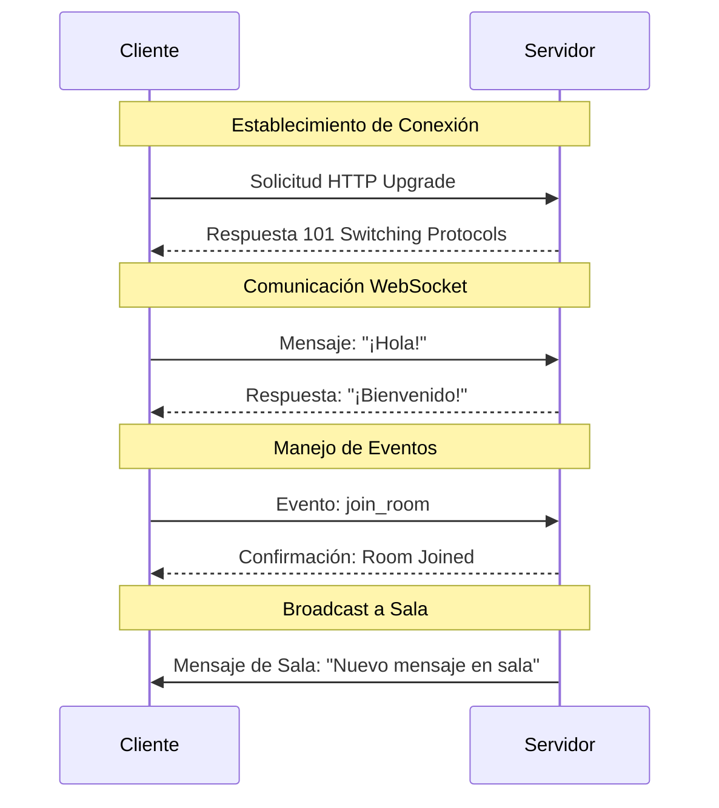

Los WebSockets son una tecnología que permite establecer una comunicación bidireccional y persistente entre el cliente y el servidor, permitiendo un intercambio de datos en tiempo real. En NestJS, podemos implementar esta funcionalidad utilizando Socket.IO, que proporciona una capa adicional sobre los WebSockets estándar con características avanzadas como manejo automático de reconexiones y salas (rooms).

###  Conceptos Fundamentales

1. **WebSocket vs Socket.IO**:
          - WebSocket es el protocolo base que permite la comunicación bidireccional
  - Socket.IO es una biblioteca que mejora WebSockets con características adicionales como:
                    - Manejo automático de reconexiones
    - Salas (rooms) para agrupar conexiones
    - Eventos personalizados
    - Compatibilidad con navegadores antiguos


2. **Flujo de Comunicación**:
          - Los clientes se conectan al servidor mediante un handshake WebSocket
  - Una vez establecida la conexión, permanece abierta
  - El servidor puede enviar mensajes a los clientes en cualquier momento
  - Los clientes pueden emitir eventos al servidor


Veamos cómo funciona el flujo de comunicación entre cliente y servidor:



El diagrama anterior muestra las tres etapas principales de la comunicación WebSocket:

1. **Establecimiento de Conexión**:
          - El cliente inicia una solicitud HTTP especial solicitando actualizar a WebSocket
  - El servidor responde con un código 101, indicando que acepta la actualización


2. **Comunicación Bidireccional**:
          - Una vez establecida la conexión, tanto el cliente como el servidor pueden enviar mensajes
  - La comunicación es full-duplex, permitiendo mensajes simultáneos en ambas direcciones


3. **Manejo de Eventos y Salas**:
          - Los eventos permiten comunicaciones estructuradas (como 'join_room')
  - Las salas facilitan el envío de mensajes a grupos específicos de clientes


###  Configuración del Proyecto

Primero, necesitamos instalar las dependencias necesarias:

```bash
npm install @nestjs/websockets socket.io
npm install @types/socket.io --save-dev
```

###  Implementación Paso a Paso

Crear el Gateway WebSocket
```typescript
// chat.gateway.ts
import { WebSocketGateway } from '@nestjs/websockets';
import { Server } from 'socket.io';

@WebSocketGateway()
export class ChatGateway {
  server: Server;

  afterInit(server: Server) {
    this.server = server;
  }

  handleConnection(client: any) {
    console.log('Cliente conectado:', client.id);
  }

  handleDisconnect(client: any) {
    console.log('Cliente desconectado:', client.id);
  }
}
```

Configurar el Módulo Principal
```typescript
// app.module.ts
import { Module } from '@nestjs/common';
import { AppController } from './app.controller';
import { AppService } from './app.service';
import { ChatGateway } from './chat.gateway';

@Module({
  imports: [],
  controllers: [AppController],
  providers: [AppService, ChatGateway],
})
export class AppModule {}
```

Implementar la Lógica de Chat

```typescript
// chat.gateway.ts (actualizado)
import { WebSocketGateway } from '@nestjs/websockets';
import { Server } from 'socket.io';
import { OnGatewayInit, OnGatewayConnection, OnGatewayDisconnect } from '@nestjs/websockets';

@WebSocketGateway()
export class ChatGateway implements OnGatewayInit, OnGatewayConnection, OnGatewayDisconnect {
  server: Server;

  afterInit(server: Server) {
    this.server = server;
  }

  handleConnection(client: any) {
    console.log('Cliente conectado:', client.id);
  }

  handleDisconnect(client: any) {
    console.log('Cliente desconectado:', client.id);
  }

  handleMessage(client: any, payload: any) {
    this.server.emit('message', payload);
  }

  joinRoom(client: any, roomName: string) {
    client.join(roomName);
    client.emit('joinedRoom', { room: roomName });
  }

  leaveRoom(client: any, roomName: string) {
    client.leave(roomName);
    client.emit('leftRoom', { room: roomName });
  }
}
```

###  Ejemplo de Cliente

```javascript
// client.js
const socket = io('http://localhost:3000');

// Escuchar mensajes
socket.on('message', (msg) => {
  console.log(`Mensaje recibido: ${msg}`);
});

// Enviar mensaje
function sendMessage() {
  const message = document.getElementById('message').value;
  socket.emit('message', message);
}

// Unirse a una sala
function joinRoom(roomName) {
  socket.emit('join_room', { roomName });
}
```

###  Mejores Prácticas

1. **Manejo de Errores**:
          - Implementar try-catch en todos los handlers
  - Enviar errores apropiados al cliente
  - Registrar logs de errores


2. **Seguridad**:
          - Validar todos los datos recibidos
  - Implementar autenticación si es necesario
  - Usar namespaces para separar diferentes tipos de conexiones


3. **Escalabilidad**:
          - Utilizar Redis para clustering
  - Implementar load balancing
  - Monitorear el uso de recursos


Esta implementación proporciona una base sólida para construir aplicaciones WebSocket en NestJS usando Socket.IO. Puedes expandirla según tus necesidades específicas, agregando más funcionalidad o características adicionales como autenticación, persistencia de mensajes, o sistema de presencia.