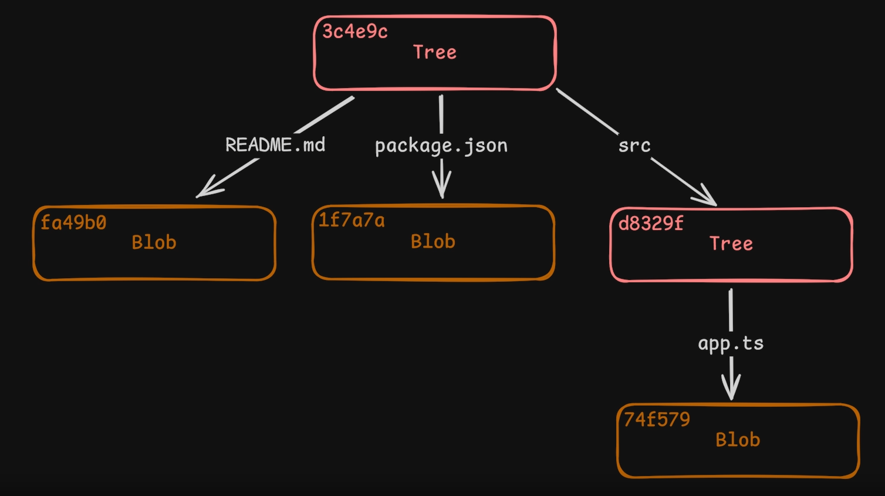

La carpeta `.git/` es el **núcleo del repositorio Git**, donde se guarda todo el historial, la configuración, y los metadatos del proyecto. Aquí tienes una **descripción general de la arquitectura de carpetas y archivos clave dentro de `.git/`**:

---

### 📁 Estructura interna de `.git/`

1. [HEAD]()
2. [Config]()
3. [Description]()
4. [Index]()
5. [Hooks](#hooks)
6. [Info](#info)
7. [Objects](#objects)
8. [Refs](#refs)
   - [Heads]()
   - [Remotes]()
   - [Tags](#tags)
9. [Logs](#logs)
10. [Packed-refs]()

---

### 📄 Archivos principales

- **`HEAD`**
  Contiene una referencia a la rama actual activa.
  Ej: `ref: refs/heads/main`

- **`config`**
  Archivo de configuración local del repositorio (nombre del usuario, URL remota, opciones de fusión, etc.)

- **`description`**
  Usado por GitWeb para mostrar una descripción del repositorio (no es importante para la mayoría de usuarios).

- **`index`**
  Es el área de _staging_. Contiene los archivos listos para el próximo commit.

- **`packed-refs`**
  Cuando Git optimiza referencias (como tags y ramas), las guarda aquí en lugar de en `refs/`.

---

### 📁 Directorios clave

#### `hooks/`

Contiene scripts que se ejecutan en eventos específicos (por ejemplo, `pre-commit`, `post-merge`). Por defecto están deshabilitados.

#### `info/`

- `exclude`: archivo para ignorar archivos como `.gitignore`, pero solo para el repositorio local.

#### `objects/`

- Aquí es donde Git guarda los **objetos** (commits, árboles, blobs, tags) como archivos comprimidos usando su **hash SHA-1**. Es la base del sistema de almacenamiento de Git.
    - **trees**: Contienen la estructura de directorios y archivos.
    - **blobs**: Contienen el contenido de los archivos.
      - Guardan los cambios especificos a archivos especificos en un momento unico (Por ej, Hoy 23/5 a las 10:00am agregué un _<h6>Hello World</h6>_"")
- Los objetos son inmutables y no se pueden modificar.



Estructura típica:

```bash
objects/
├── 1a/
│   └── b2c3d... (archivos de objetos)
├── 4f/
│   └── 9d8e...
...
```
#### `refs/`

Contiene punteros simbólicos a commits específicos:

- `refs/heads/`: ramas locales
  - `refs/heads/main`: rama principal, **la rama activa**
- `refs/remotes/`: ramas remotas
- `refs/tags/`: etiquetas de versiones (como `v1.0`, `v2.0`, etc.)


#### `logs/`

Git mantiene un registro de los movimientos de las referencias (por ejemplo, cuándo cambias de rama o haces un `commit`).

---

### 🧠 En resumen:

| Carpeta/Archivo | Función principal                                                    |
| --------------- | -------------------------------------------------------------------- |
| `HEAD`          | Apunta a la rama actual                                              |
| `config`        | Configuración del repositorio                                        |
| `index`         | Área de staging (pre-commit)                                         |
| `objects/`      | Contiene todo el historial del repositorio (archivos, commits, etc.) |
| `refs/heads/`   | Ramas locales                                                        |
| `refs/remotes/` | Ramas remotas                                                        |
| `refs/tags/`    | Tags (etiquetas de versiones)                                        |
| `logs/`         | Registro de cambios en referencias                                   |
| `hooks/`        | Scripts automáticos en eventos de Git                                |
| `info/exclude`  | Ignorar archivos de forma local                                      |

---

### 📚 Recursos adicionales

#### Tags
Los tags son nombres que apuntan a un commit específico y nos permiten marcar un punto en la historia del proyecto.

- Para ver los tags que tenemos en nuestro repositorio podemos mirar la carpeta .git/refs/tags
- Listar todas las etiquetas: **git tag**
- Buscar etiquetas específicas: **git tag -l "v1.*"**
- Compartir etiquetas con otros: **git push origin --tags**
- Crear una nueva etiqueta: **git tag -a v1.0.0 -m "Versión 1.0.0"**
- Eliminar una etiqueta: **git tag -d v1.0.0**
- Verificar una etiqueta: **git verify-tag v1.0.0**